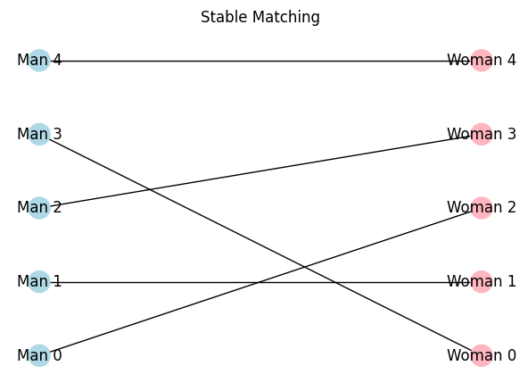
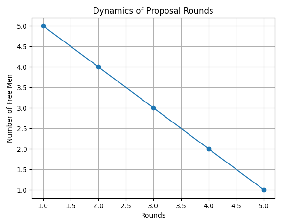
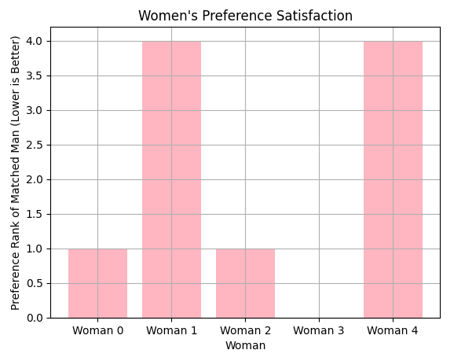

Imagine matching **n** men and **n** women such that no pair of individuals would prefer each other over their current matches. If such a scenario exists where no two individuals would rather be with each other than their assigned partners, the matching is deemed stable. More formally a **Matching** is a bijection between two sets (e.g., men and women), where each element from one set is paired with exactly one element from the other set and a matching is **stable** if there are no two elements, one from each set, who would both prefer each other over their current matches. Such a pair is called a **blocking pair**, and their existence would render the matching unstable

## The Gale-Shapley Algorithm

The gale-shapley algorithm guarantees the existence of a stable matching for any set of preferences. The algorithm operates in iterative rounds, where one group (traditionally men) proposes to their most preferred choice, and the other group (women) tentatively accepts the best offer they receive while rejecting the rest. This process continues until all participants are matched

1. **Initialization**: All men and women are initially free.
2. **Proposal Phase**:
   - Each free man proposes to the highest-ranked woman on his preference list who hasn't rejected him yet.
   - Each woman considers all proposals received in the current round.
3. **Acceptance Phase**:
   - Each woman tentatively accepts the proposal from the man she prefers most among those who proposed and rejects the others.
   - Rejected men become free again and will propose to their next preferred woman in subsequent rounds.
4. **Termination**: The algorithm concludes when there are no free men left, resulting in a stable matching.

```python
def gale_shapley(men_prefs, women_prefs):
    n = len(men_prefs)
    free_men = list(range(n))
    men_next_proposal = [0] * n
    women_engaged_to = [-1] * n

    # Precompute women's preference rankings for quick comparison
    women_rankings = []
    for prefs in women_prefs:
        ranking = {man: rank for rank, man in enumerate(prefs)}
        women_rankings.append(ranking)

    while free_men:
        man = free_men.pop(0)
        woman = men_prefs[man][men_next_proposal[man]]
        men_next_proposal[man] += 1

        if women_engaged_to[woman] == -1:
            # Woman is free
            women_engaged_to[woman] = man
        else:
            current_man = women_engaged_to[woman]
            # Check if the new man is preferred over the current engagement
            if women_rankings[woman][man] < women_rankings[woman][current_man]:
                women_engaged_to[woman] = man
                free_men.append(current_man)
            else:
                free_men.append(man)

    # Prepare the result: man -> woman
    man_to_woman = [-1] * n
    for woman, man in enumerate(women_engaged_to):
        man_to_woman[man] = woman

    return man_to_woman

men_preferences = [
    [2, 1, 4, 3, 0],
    [1, 0, 2, 3, 4],
    [3, 4, 1, 0, 2],
    [0, 2, 4, 1, 3],
    [4, 3, 1, 2, 0],
]

women_preferences = [
    [3, 1, 0, 2, 4],
    [0, 2, 4, 3, 1],
    [1, 0, 3, 4, 2],
    [4, 2, 1, 0, 3],
    [2, 3, 1, 0, 4],
]

result = gale_shapley(men_preferences, women_preferences)
print("Stable Matching:", result)
```

```bash
user@user:~$ python3.10 gale_shapley.py
Stable Matching: [0, 1, 2]
```

This matching is stable because there are no two individuals who would prefer each other over their current partners.

To better grasp how the Gale-Shapley algorithm progresses, let's visualize the proposals and engagements

```python
import matplotlib.pyplot as plt
import networkx as nx

def visualize_matching(men_prefs, women_prefs, matching):
    G = nx.Graph()
    n = len(matching)
    men = [f"Man {i}" for i in range(n)]
    women = [f"Woman {i}" for i in range(n)]
    
    G.add_nodes_from(men, bipartite=0)
    G.add_nodes_from(women, bipartite=1)
    
    edges = []
    for man, woman in enumerate(matching):
        edges.append((f"Man {man}", f"Woman {woman}"))
    
    G.add_edges_from(edges)
    
    pos = {}
    pos.update((node, (1, index)) for index, node in enumerate(men))
    pos.update((node, (2, index)) for index, node in enumerate(women))
    
    plt.figure(figsize=(6, 4))
    nx.draw(G, pos, with_labels=True, node_color=['lightblue' if node.startswith('Man') else 'lightpink' for node in G.nodes()])
    plt.title("Stable Matching")
    plt.show()

visualize_matching(men_preferences, women_preferences, result)
```



### Stability of the Matchings

One of the most important characteristics of the Gale-Shapley algorithm is the stability of the matchings it produces. Stability means that no pair of individuals from opposite sets (men and women) would prefer each other over their current matches.

We can analyze stability visually by considering **preference rankings** and how the algorithm satisfies each participant’s preferences. Consider an example where:
- Men have preferences for women.
- Women have preferences for men.
- The goal is to find a matching where there are no "blocking pairs."

A **blocking pair** would occur if, for example, a man preferred a woman who was matched to another man, and that woman also preferred the first man over her current partner. The beauty of the Gale-Shapley algorithm is that such a situation is impossible when the algorithm concludes.

### Dynamics of Preference and Proposals

Let’s visualize the **proposal dynamics**. Men make sequential proposals based on their preferences, and women tentatively accept or reject proposals based on their own preferences. This process guarantees that men continue proposing until they find a stable match.

Below is a plot showing how many rounds of proposals occur before the matching stabilizes. Each round is represented by the number of men who are still free and proposing.

```python
def plot_proposals_dynamics(men_preferences, women_preferences):
    free_men_count = []
    n = len(men_preferences)
    free_men = list(range(n))
    men_next_proposal = [0] * n
    women_engaged_to = [-1] * n

    women_rankings = []
    for prefs in women_preferences:
        ranking = {man: rank for rank, man in enumerate(prefs)}
        women_rankings.append(ranking)

    rounds = 0
    while free_men:
        rounds += 1
        free_men_count.append(len(free_men))
        
        man = free_men.pop(0)
        woman = men_preferences[man][men_next_proposal[man]]
        men_next_proposal[man] += 1

        if women_engaged_to[woman] == -1:
            women_engaged_to[woman] = man
        else:
            current_man = women_engaged_to[woman]
            if women_rankings[woman][man] < women_rankings[woman][current_man]:
                women_engaged_to[woman] = man
                free_men.append(current_man)
            else:
                free_men.append(man)

    plt.plot(range(1, rounds+1), free_men_count, marker='o', linestyle='-')
    plt.title("Dynamics of Proposal Rounds")
    plt.xlabel("Rounds")
    plt.ylabel("Number of Free Men")
    plt.grid(True)
    plt.show()

plot_proposals_dynamics(men_preferences, women_preferences)
```



This plot shows the number of free men after each round of proposals. As the algorithm progresses, the number of free men decreases until all participants are matched, indicating the matching's convergence.

### Optimality: Who Benefits?

Men propose in decreasing order of preference, meaning each man is guaranteed the best match possible among all stable matchings. On the other hand, women are left with the least preferred partners they could have in any stable matching. The Gale-Shapley algorithm optimizes for the proposing group, as most men will be paired with their highly preferred partners.

### Suboptimality for the Receiving Group

While the algorithm is optimal for the proposing group (men), it leaves the receiving group (women) with suboptimal matches. Women are paired with their least preferred partners among all stable matchings.


```python
def plot_women_optimality(women_prefs, matching):
    preference_ranks = []
    for man, woman in enumerate(matching):
        rank = women_prefs[woman].index(man)
        preference_ranks.append(rank)

    plt.bar(range(len(preference_ranks)), preference_ranks, color='lightpink')
    plt.title("Women's Preference Satisfaction")
    plt.xlabel("Woman")
    plt.ylabel("Preference Rank of Matched Man (Lower is Better)")
    plt.xticks(range(len(preference_ranks)), [f"Woman {i}" for i in range(len(preference_ranks))])
    plt.grid(True)
    plt.show()

plot_women_optimality(women_preferences, result)
```



This plot reveals that women generally end up with less optimal partners compared to men, as the algorithm is biased in favor of the proposing group. The higher ranks for women indicate suboptimal matches.

## Conclusion

The Gale-Shapley algorithm consistently finds stable matchings in O(n^2) time, making it computationally efficient even for large datasets. The proposal dynamics show that the number of free men decreases steadily with each round of proposals, ensuring rapid convergence to a stable matching.

While the algorithm guarantees stability, it introduces a bias in favor of the proposing group. Men (the proposers) always receive their best possible matches, while women (the receivers) are left with less optimal matches. This asymmetry has implications in real-world scenarios, such as medical residency assignments or college admissions, where fairness and equity are important considerations.