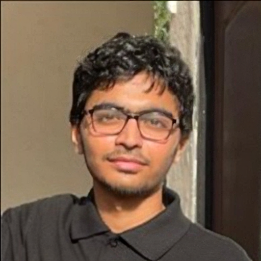

---
# Feel free to add content and custom Front Matter to this file.
# To modify the layout, see https://jekyllrb.com/docs/themes/#overriding-theme-defaults

layout: page
---

{: style="float: right; margin: 0px 20px; width: 350px;" name="darshan"}

My name is Darshan Makwana, I am a 3rd year UG student at [IIT Bombay](https://en.wikipedia.org/wiki/IIT_Bombay). I will be joining [Sprinklr](https://www.sprinklr.com/) this summer as an AI product intern

Previously I did my research internship at [TUM](https://www.tum.de/en/) (Summer 2023) working on [quadruped robotics](https://www.notion.so/System-Identification-and-Model-Based-Deep-Reinforcement-Learning-for-Agile-and-Robust-Quadruped-Rob-d64a6f1dd4434a18b57f3c60cdb16fe3?pvs=4). I also interned at [Hexo AI](https://www.hexo.ai/) wherein I got a chance to work on some of the cool [diffusion models](https://en.wikipedia.org/wiki/Diffusion_model#:~:text=A%20diffusion%20model%20consists%20of,distribution%20of%20a%20given%20dataset.) and [llms](https://en.wikipedia.org/wiki/Large_language_model) out there. 

I am currently working with Prof. [Avishek Ghosh](https://sites.google.com/view/avishekghosh/home) on improving the efficiency of clustered federated learning

Email ID: [darshanmakwana412@gmail.com](darshanmakwana412@gmail.com)