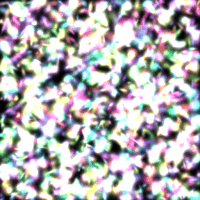
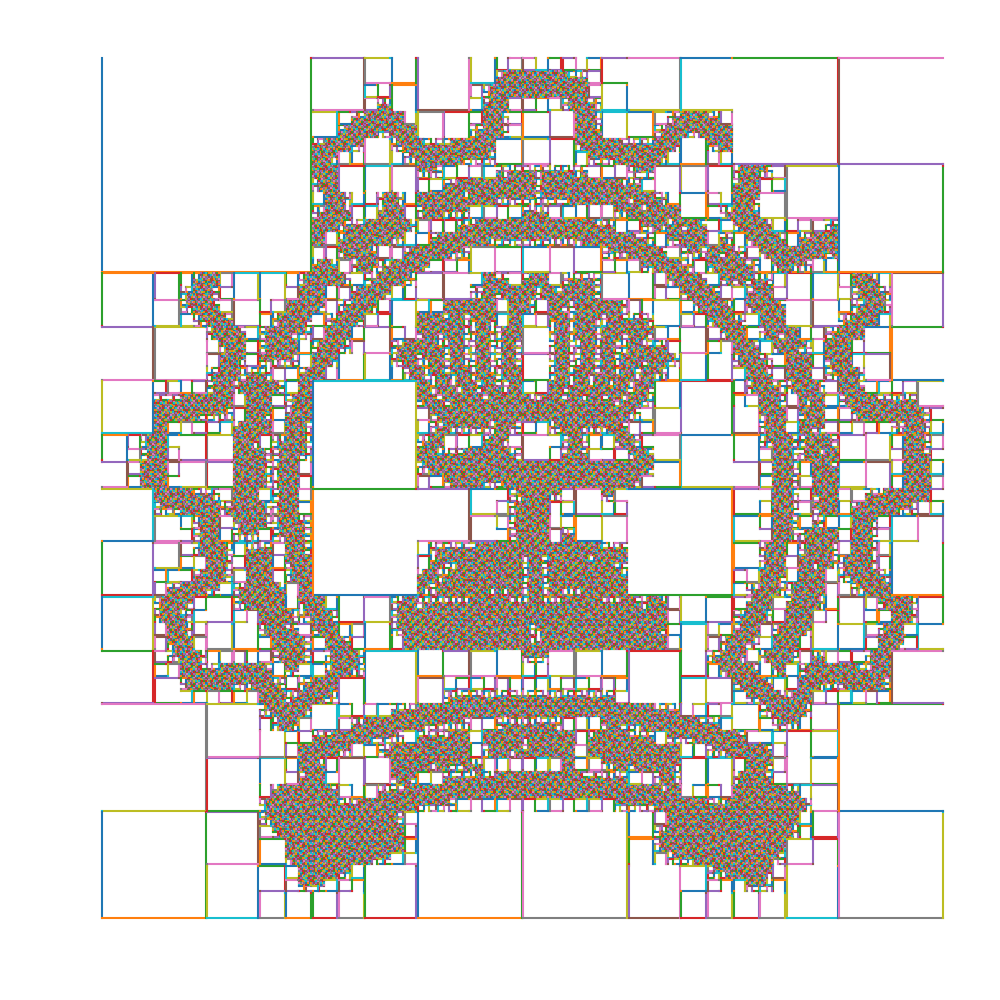
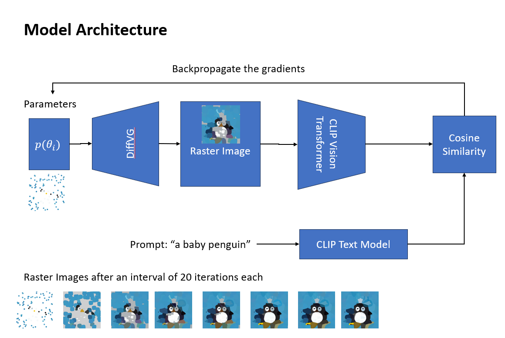

    
Minimal 2D Gaussian Splatting

    
Implimentation of the original gaussian splatting paper for 2D images using tile based differential rasterization leveraging triton kernels

    

    <a href="https://github.com/darshanmakwana412/mings">[Code]</a>
    

    
Multi View Reconstruction

    
Reconstructing 3d objects from images by applying volumetric graph cut on visual hulls followed by ray casting for shading

    

    <a href="https://github.com/darshanmakwana412/Multi_View_Reconstruction/blob/main/report.pdf">[Report]</a>
    <a href="https://github.com/darshanmakwana412/Multi_View_Reconstruction">[Code]</a>
    

    
Struct Optim

    
A gradient-based optimization framework that leverages efficient matrix formulation of the system to compute the optimal spatial configuration of a structure for a given set of loadings

    

    <a href="https://github.com/darshanmakwana412/structure_optimization/blob/main/main.pdf">[Paper]</a>
    <a href="https://github.com/darshanmakwana412/structure_optimization/tree/main">[Code]</a>
    

    
Fractal Curves for Tool Path Planning

    
Using Fractal curves for tool path planning in layered 3d printing

    

    <a href="https://github.com/darshanmakwana412/fractal/blob/main/draft/tool_path_planning.pdf">[Paper]</a>
    <a href="https://github.com/darshanmakwana412/fractal">[Code]</a>
    

    
Stable Vectors

    
Generating stable vectors graphics using text conditional optimization

    

    <a href="https://github.com/darshanmakwana412/StableVectors?tab=readme-ov-file">[Code]</a>
    

